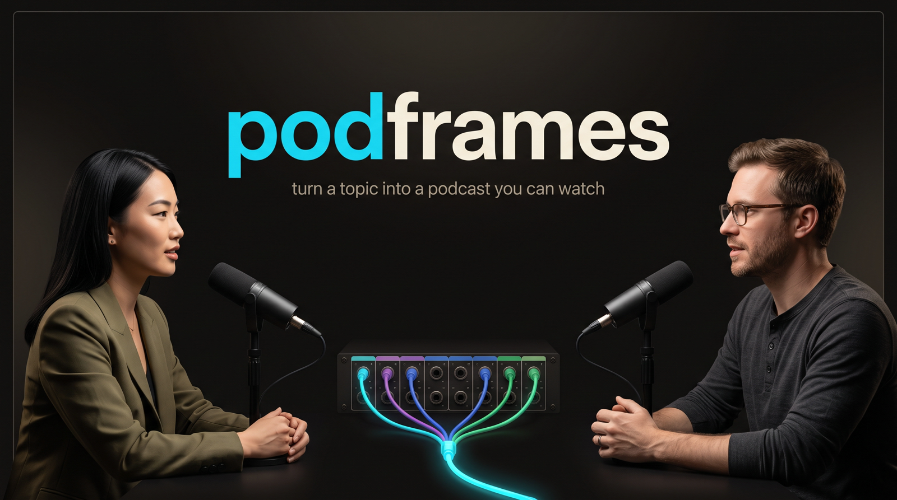
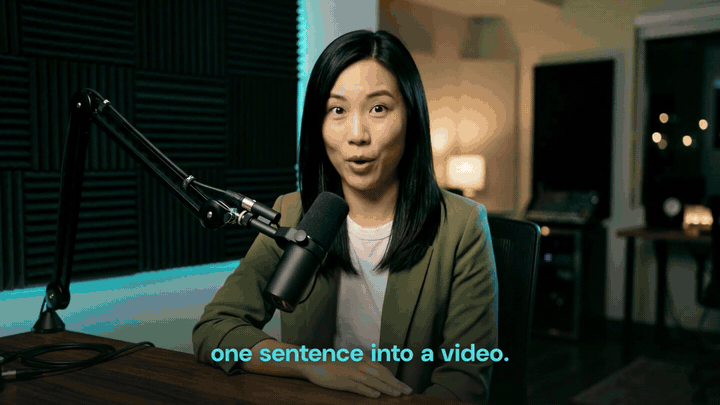
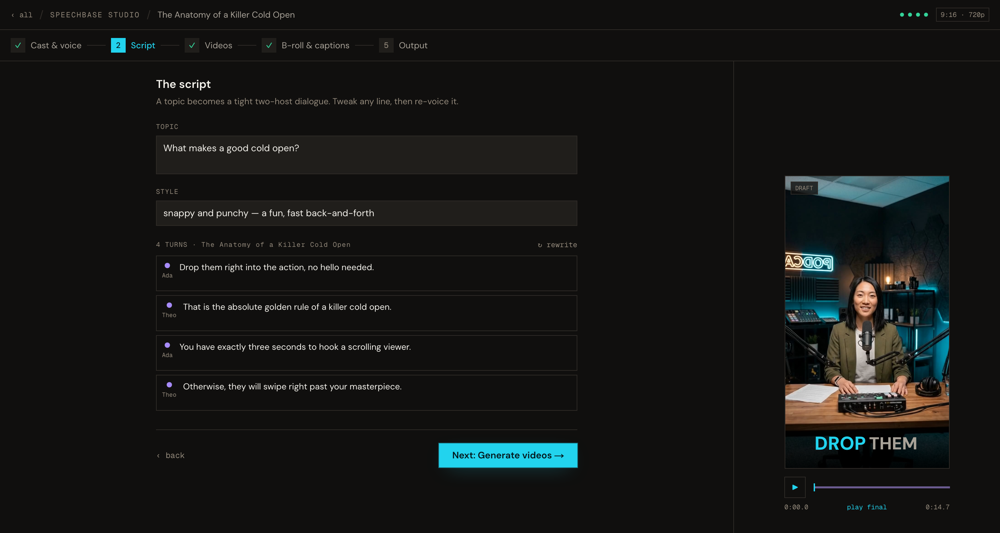

<div align="center">



<br/>
<br/>

**One line of input → a two‑host AI podcast video: mixed voices, lip‑synced avatars, word‑timed captions.**

[](https://github.com/Jellypod-Inc/podframes/actions/workflows/ci.yml)
[](LICENSE)
[](package.json)
[](https://speechbase.ai)

</div>

<!--
  HERO VIDEO — one manual step, in the GitHub web editor only:
  edit this README on github.com, drag in the launch video
  (projects/_launch/video/launch-video-readme.mp4 locally, 6 MB — under the
  10 MB inline-player cap), and replace this comment with the generated
  https://github.com/user-attachments/assets/… URL on its own line.
  GitHub renders that URL as an inline video player; committed mp4s don't render.
-->

---

podframes writes a two‑host script with Gemini, mixes **different TTS providers into one
conversation** with [Speechbase](https://speechbase.ai), **lip‑syncs each host to that real
audio** with P‑Video by default, and renders a captioned MP4 with
[HyperFrames](https://hyperframes.heygen.com).

```
  topic
    │
    ├─▶  ① script    Gemini 3.1 Pro       two-host dialogue, alternating turns
    ├─▶  ② speech    Speechbase           mix any providers → one leveled conversation
    │                                      + word-level alignment timestamps
    ├─▶  ③ avatars   Nano Banana 2        one base avatar image per host
    ├─▶  ④ animate   P-Video | LTX-2.3    per-turn lip-synced clips
    ├─▶  ⑤ b-roll    Gemini + NB2 Lite    sparse cues from the aligned transcript
    ├─▶  ⑥ compose   HyperFrames HTML     timed clips + audio + captions + b-roll
    └─▶  ⑦ render    HyperFrames          → output.mp4
```

The star is **step ②**: each host can be a *different* TTS provider (Google + ElevenLabs +
OpenAI + Cartesia + …), and Speechbase returns one stitched, volume‑leveled conversation **plus
word‑level timestamps** — which flow straight into lip‑sync clips, karaoke captions, and b‑roll
timing with zero glue. Step ④ then animates each turn against its *actual* audio, so the mouths
match the words.

## Quickstart

Prerequisites: **Node ≥ 22**, **pnpm**, **ffmpeg** on PATH.

```bash
# 1 · install
pnpm install

# 2 · add keys
cp .env.example .env.local
#    SPEECHBASE_API_KEY=sk_...      https://speechbase.ai
#    GEMINI_API_KEY=AIza...         https://aistudio.google.com/apikey  (paid key for image models)
#    REPLICATE_API_KEY=...          https://replicate.com/account/api-tokens  (default video provider)
#    (FAL_API_KEY only if you switch to --provider fal-ltx)

# 3 · preflight
pnpm podframes doctor

# 4a · CLI
pnpm podframes generate --topic "Why is the sky blue?" --turns 10

# 4b · or the web studio (pick voices, watch it run live)
pnpm dev:web        # → http://localhost:3000
```

> **Install blocked by a release‑age guard?** If your global pnpm config sets `minimumReleaseAge`,
> some of these fast‑moving SDKs are too new. See [`.npmrc`](.npmrc) for a surgical, per‑package
> opt‑out for the trusted publishers (Google, Jellypod, HeyGen, Vercel).

### Try it cheap first

The studio is a linear wizard, and **Step 2 stops after the mixed conversation audio** — play the
Speechbase mix and export word‑timed SRT/VTT captions before spending anything on video. Only the
later steps touch image/video APIs, and the studio quotes a **cost estimate before every
animation run**. The CLI equivalent is `--to speech`.

## The studio



A five‑step wizard over the same pipeline the CLI runs, with the receipts visible:

- **Live runs that survive anything** — generation runs server‑side; reload the tab, open a second
  one, or come back later and the studio reattaches to the stream mid‑run. Stop is one click.
- **Per‑line economics** — edit one line and only that line's audio + clip are re‑bought. Check
  three clips and exactly three clips regenerate, with the dollar estimate on the button.
- **Nothing is silently destroyed** — any edit that invalidates paid artifacts says exactly what
  it cleared, and destructive switches confirm first with real counts.
- **A preview that tells the truth** — the right pane plays your actual generated clips with the
  same caption grouping the final render uses, on a provider‑colored timeline (the patch‑bay,
  visible).
- **8 caption styles that actually differ** — from `slam` (two huge words a beat) to `boxed`
  (full subtitle line), each with its own phrase length and type scale.
- **One avatar per host, voice separate** — pick a face from the roster or upload a photo; that
  exact image is the first frame every clip animates from. Voices are chosen independently.



## Video providers

Both are **per‑turn audio‑to‑video with real lip‑sync** — each line becomes its own clip, driven
by that turn's actual Speechbase audio. Pick with `--provider` (CLI) or one click in the studio.

| Provider | id | Fidelity | Price | Notes |
| --- | --- | --- | --- | --- |
| **P‑Video** (Replicate) | `replicate-p-video` | good | ≈$0.02/s @720p · ≈$0.04/s @1080p | **Default.** Cheaper, faster |
| **LTX‑2.3** (fal.ai) | `fal-ltx` | best | ≈$0.10/s | Higher-fidelity alternative. Static locked‑off shot, prompt expansion disabled |

## Models

Centralized in [`packages/core/src/config.ts`](packages/core/src/config.ts) — a model bump is one line.

| Stage  | Model id (July 2026)             | Notes                                              |
| ------ | -------------------------------- | -------------------------------------------------- |
| script | `gemini-3.1-pro-preview`         | High‑quality dialogue                              |
| cues   | `gemini-3.1-pro-preview`         | B‑roll/caption editorial judgment (same as script) |
| avatars | `gemini-3.1-flash-image`        | **Nano Banana 2** — only for text‑described hosts (roster picks / uploads pass through) |
| b‑roll | `gemini-3.1-flash-lite-image`    | **Nano Banana 2 Lite** — ≈4s/image, ≈$0.034/image  |
| video  | `prunaai/p-video` (Replicate)    | **Default.** Cheaper/faster per‑turn lip‑sync      |
| video  | `fal-ai/ltx-2.3-quality/audio-to-video` | Alternative: LTX‑2.3, per‑turn audio‑to‑video, real lip‑sync |
| speech | `provider/model` per turn        | via `@speech-sdk/core`, routed through Speechbase (add BYOK keys in your Speechbase account) |

## Cost (rough, paid keys)

Treat these as relative orders of magnitude, not quotes — providers reprice often.

- **Speechbase** — by characters; a short episode is cents. Free tier covers demos.
- **Images (Google's [price sheet](https://ai.google.dev/gemini-api/docs/pricing))** — roster
  picks and uploaded photos cost nothing; a text‑described host generates one avatar on Nano
  Banana 2 ($0.067 at 1K / $0.101 at 2K). B‑roll uses Nano Banana 2 Lite at ≈$0.034/image.
  A handful per episode — dimes, not dollars.
- **Video — the dominant cost.** Every spoken second is generated video, so it scales linearly
  with episode duration: LTX‑2.3 is **≈$0.10/s** (a 90‑second episode ≈ $9); P‑Video is
  **≈$0.02/s at 720p** (≈ $1.80). The studio shows this estimate before you click Generate.

## Architecture

A pnpm monorepo:

```
packages/core     @podframes/core — the typed, resumable pipeline engine
apps/cli          podframes — headless CLI runner
apps/web          @podframes/web — Next.js showcase + studio (server-side runs, SSE reattach)
projects/<slug>/  per-run artifacts (script, audio, stills, clips, composition, output.mp4)
design.md         brand truth for BOTH the web app and the rendered video
```

Every run is **resumable at two levels**: stages skip themselves when their artifact exists, and
the speech/video stages resume **per turn** — a transient failure on turn 9 of 10 re‑buys one
turn, not ten. Resume from any point with `--from stills` (or `--force` to redo). State lives in
`projects/<slug>/project.json`.

### Scripting the engine

podframes is a **local tool** — clone it, add keys, and drive it through the CLI or the studio.
`@podframes/core` isn't published to npm and isn't going to be; if the CLI flags don't cover what
you want, script the engine directly inside the repo (drop a file in `scripts/` and run it with
`pnpm exec tsx`):

```ts
// scripts/my-episode.mts
import { generate, DEFAULT_HOSTS } from "@podframes/core";

await generate(
  { topic: "The history of coffee", hosts: DEFAULT_HOSTS, aspectRatio: "16:9" },
  { root: process.cwd(), onEvent: (e) => console.log(e.stage, e.message) },
);
```

`scripts/showcase.mts` and `scripts/brand-assets.mts` are real examples of the same pattern.

## Good to know

- **The web app is a local tool**, not a deployable site: its API routes proxy *your* keys from
  `.env.local` and it reads/writes `projects/` on *your* disk. There is no auth layer. Don't
  deploy it publicly as‑is.
- **HyperFrames downloads a headless Chrome** on first render — `pnpm podframes doctor` checks
  everything (node, ffmpeg, keys) before you spend.
- **Agent‑assisted development**: the skills used to build this repo are pinned in
  [`skills-lock.json`](skills-lock.json) and fetched locally into `.agents/` (gitignored). House
  rules live in [CONTRIBUTING.md](CONTRIBUTING.md).

## Built with

[Speechbase](https://speechbase.ai) · [`@speech-sdk/core`](https://github.com/Jellypod-Inc/speech-sdk) ·
[Google Gemini](https://ai.google.dev) (Nano Banana 2 + Lite) · [fal.ai](https://fal.ai) (LTX‑2.3) ·
[Replicate](https://replicate.com) (p‑video) · [HyperFrames](https://hyperframes.heygen.com) · Next.js

## License

[Apache‑2.0](LICENSE) © [Jellypod, Inc.](https://jellypod.ai)
